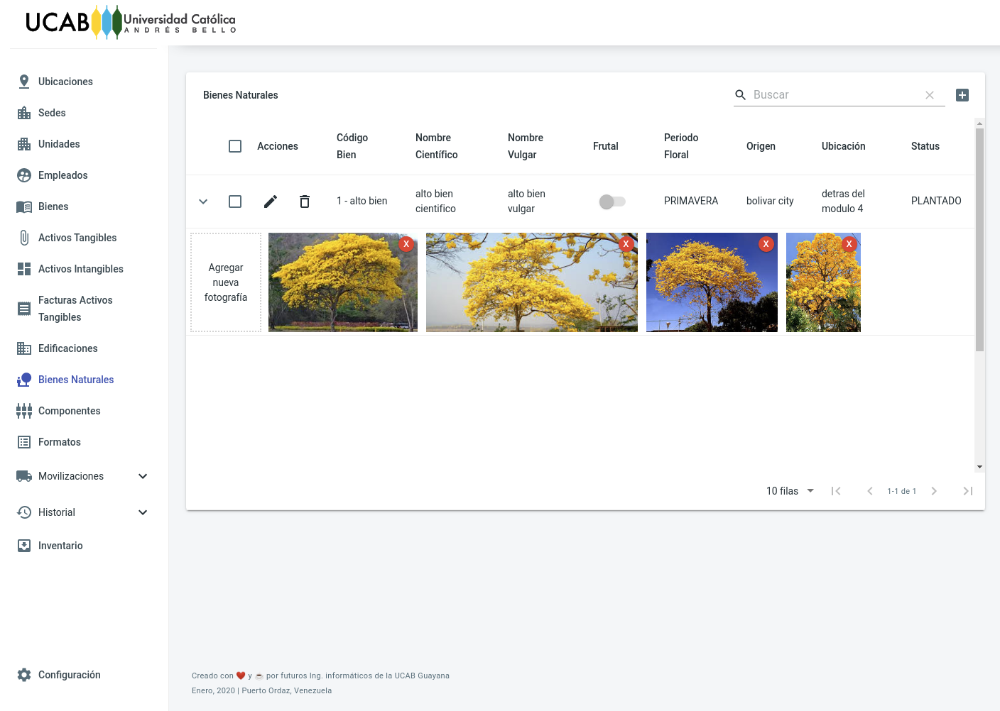

# Proyecto BD 1

Sistema de gestión de:
- Sedes
- Unidades
- Empleados
- Bienes (tangibles, intangibles, edificaciones, bienes naturales)
- Componentes
- Movilizaciones de bienes
- Inventario
- Historial

## License
MIT